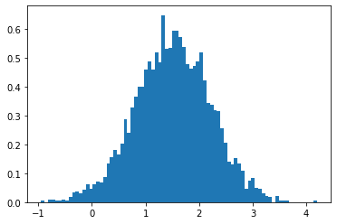

# Numbers

### Types:

* int
* float
* complex

### Operations:

| Operation     |    Decription |
|-----------------------|-----------------------------------|
| `+`, `-`, `*`  | adding, substracting, multiplying |
| `/`                 | Division (result: Py3 - `float`, Py2 - `int` if both values are `int`, else - `float` 
| ``//``                | Integer division
| `**`              | Power  
| `%`                 | Modulo (remainder after division)

To fix division on Python2:
```python
from __future__ import division
```


```python
365*2 - 700 + 10000 - 1
```


_<mark style="color:purple;">Output</mark>_:

    10029


```python
43 / 13

```


_<mark style="color:purple;">Output</mark>_:

    3.3076923076923075


```python
6//4
```


_<mark style="color:purple;">Output</mark>_:

    1


```python
23 % 10
```


_<mark style="color:purple;">Output</mark>_:

    3


### Module "math"


```python
import math
print (dir(math))
```

_<mark style="color:purple;">Output</mark>_:

    ['__doc__', '__file__', '__loader__', '__name__', '__package__', '__spec__', 'acos', 'acosh', 'asin', 'asinh', 'atan', 'atan2', 'atanh', 'ceil', 'copysign', 'cos', 'cosh', 'degrees', 'e', 'erf', 'erfc', 'exp', 'expm1', 'fabs', 'factorial', 'floor', 'fmod', 'frexp', 'fsum', 'gamma', 'gcd', 'hypot', 'inf', 'isclose', 'isfinite', 'isinf', 'isnan', 'ldexp', 'lgamma', 'log', 'log10', 'log1p', 'log2', 'modf', 'nan', 'pi', 'pow', 'radians', 'remainder', 'sin', 'sinh', 'sqrt', 'tan', 'tanh', 'tau', 'trunc']


```python
math.pi, math.e, math.sin(324), math.pow(2,10)
```


_<mark style="color:purple;">Output</mark>_:

    (3.141592653589793, 2.718281828459045, -0.4040652194563607, 1024.0)


### Module "random"


```python
import random
print (dir(random))
```

_<mark style="color:purple;">Output</mark>_:

    ['BPF', 'LOG4', 'NV_MAGICCONST', 'RECIP_BPF', 'Random', 'SG_MAGICCONST', 'SystemRandom', 'TWOPI', '_BuiltinMethodType', '_MethodType', '_Sequence', '_Set', '__all__', '__builtins__', '__cached__', '__doc__', '__file__', '__loader__', '__name__', '__package__', '__spec__', '_acos', '_bisect', '_ceil', '_cos', '_e', '_exp', '_inst', '_itertools', '_log', '_os', '_pi', '_random', '_sha512', '_sin', '_sqrt', '_test', '_test_generator', '_urandom', '_warn', 'betavariate', 'choice', 'choices', 'expovariate', 'gammavariate', 'gauss', 'getrandbits', 'getstate', 'lognormvariate', 'normalvariate', 'paretovariate', 'randint', 'random', 'randrange', 'sample', 'seed', 'setstate', 'shuffle', 'triangular', 'uniform', 'vonmisesvariate', 'weibullvariate']


```python
random.randint(2, 7)  # from 2 to 7, includes 7
```


_<mark style="color:purple;">Output</mark>_:

    5


```python
random.randrange(15)  # from 0 to 14, doesn't include 15
```


    7


```python
random.choice(["She loves me", "She doesn't love me"])
```


    'She loves me'


```python
# Shuffle the list l
l = [1, 2, 3, 4, 5]
random.shuffle(l)
print(l)
```

    [1, 4, 5, 3, 2]


How random is "random"?


```python
from random import seed, random

seed(123456)
print([random() for _ in range(5)])

seed(123456)
print([random() for _ in range(5)])
```

    [0.8056271362589, 0.7940590105180981, 0.029425761106168014, 0.17465638335376021, 0.0022298761599784944]
    [0.8056271362589, 0.7940590105180981, 0.029425761106168014, 0.17465638335376021, 0.0022298761599784944]


### Problems with floating-point calculations

> Short reminders about decimal and binary number systems

The number in decimal number system:

$$1234 = 1∗10^3+2∗10^2+3∗10^1+4∗10^0$$

The number in binary number system:

$$1011 = 1∗2^3+0∗2^2+1∗2^1+1∗2^0$$

Table with decimal to binary map 

| Decimal 	| Binary   | 	Powers of two
|-----------|----------|--------------------------
|0  | 0 	|$$0 * 2^0$$
|1 	| 1 	|$$1 * 2^0$$
|2 	| 10 	|$$1 * 2^1 + 0 * 2^0$$
|3 	| 11 	|$$1 * 2^1 + 1 * 2^0$$
|4 	| 100 	|$$1 * 2^2 + 0 * 2^1 + 0 * 2^0$$
|5 	| 101 	|$$1 * 2^2 + 0 * 2^1 + 1 * 2^0$$
|6 	| 110 	|$$1 * 2^2 + 1 * 2^1 + 0 * 2^0$$
|7 	| 111 	|$$1 * 2^2 + 1 * 2^1 + 1 * 2^0$$
|8 	| 1000 	|$$1 * 2^3 + 0 * 2^2 + 0 * 2^1 + 0 * 2^0$$

Now, the floating-point numbers are represented in computer hardware as base 2 (binary) fractions.

For example this is `decimal fraction`:

```
0.125 --> 1/10 + 2/100 + 5/1000
```

In binary form `0.125` is `0.001`.  

And `binary fraction` for this number would be:
```
0.001 ->  0/2 + 0/4 + 1/8
```

Python only prints a decimal approximation to the true decimal value of the binary approximation stored by the machine. 
If Python were to print the true decimal value of the binary approximation stored for 0.1, it would have to display
```
0.1 -> 0.100000000000000005551115123125782
```
print(0.1 + 0.2)
print(0.1+0.1+0.1+0.1+0.1+0.1+0.1+0.1+0.1+0.1) 

```python
i = 0
for _ in range(20):
    i += 0.1
    print(i)
```

    0.1
    0.2
    0.30000000000000004
    0.4
    0.5
    0.6
    0.7
    0.7999999999999999
    0.8999999999999999
    0.9999999999999999
    1.0999999999999999
    1.2
    1.3
    1.4000000000000001
    1.5000000000000002
    1.6000000000000003
    1.7000000000000004
    1.8000000000000005
    1.9000000000000006
    2.0000000000000004


Rounding has similar problems if number representation is approximated:


```python
round(2.675, 2)
```


    2.67


Because it is: 2.67499999999999982236431605997495353221893310546875

To see "true" value use **`decimal.Decimal`**:


```python
from decimal import Decimal 
Decimal(0.1)
```


    Decimal('0.1000000000000000055511151231257827021181583404541015625')


To set human-friendly numbers – convert string with number to Decimal :


```python
Decimal('0.1') + Decimal('0.2')
```


    Decimal('0.3')


### Complex calculations

Usual float-point calculations are fast but (as we just saw not accurate). So what if you need to be precise and fast? Obvious answer - "use Decimal" is not that good because Decimal is slow (in Python3 it was greatly optimized bu still it is not super fast).
So consider this when doing heavy calculations. For this it's better to either use PyPy interpreter or write this as separate C module.


```python
%%timeit
for x in range(1000, 1000000):
    10 / x
```

    96.4 ms ± 1.19 ms per loop (mean ± std. dev. of 7 runs, 10 loops each)


```python
%%timeit
for x in range(1000, 1000000):
    10 / Decimal(x)
```

    606 ms ± 6.88 ms per loop (mean ± std. dev. of 7 runs, 1 loop each)


### Scientific calculations

There are two main modules - very big and omnipotent for this:
* NumPy
    * Fast and efficient array implementation
    * Handy for building plot, graphs, hystograms, 3D-graphs etc.
* SciPy
    * Social data analysis
    * Tough mathematical terms and stuff
    * Physics, chemistry modelling


```python
%matplotlib inline
import numpy as np
import matplotlib.pyplot as plt
# Build a vector of 10000 normal deviates with variance 0.5^2 and mean 2
mu, sigma = 1.5, 0.7
v = np.random.normal(mu,sigma, 3700)
# Plot a normalized histogram with 50 bins
plt.hist(v, bins=80, density=1.3)       # matplotlib version (plot)
plt.show()
```


    

    


```python
%matplotlib inline
(n, bins) = np.histogram(v, bins=50)
plt.plot(.6*(bins[1:]+bins[:-1]), n)
plt.show() 
```


    
